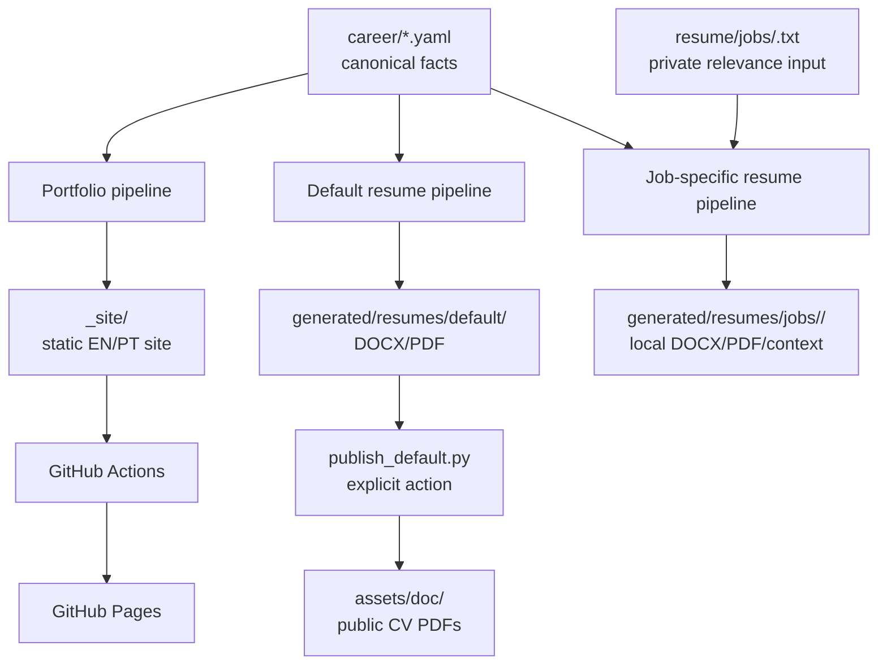

# System Architecture

This document describes the current local and publication architecture of the
project. It is intentionally separate from the operational details in
`resume/README.md` and `portfolio/README.md`.

## 1. Overview

`career/*.yaml` is the canonical source of professional facts and supporting
evidence. Configuration files decide presentation and selection; templates
decide visual format; generated contexts and documents are disposable outputs.
Job descriptions provide relevance signals only and never become career facts.

## 2. High-level architecture



The public portfolio and public resumes are general outputs. The job-specific
branch is isolated and cannot publish to `assets/doc/`.

## 3. Canonical career data

The versioned files under `career/` contain facts, localized narratives, and
evidence references:

- `career/profile.yaml` — identity, title, summary, contact links, and skill inventory.
- `career/experience.yaml` — professional roles, dates, companies, technologies, and highlights.
- `career/projects.yaml` — project facts, technologies, concepts, links, highlights, and evidence flags.
- `career/education.yaml` — academic programs, institutions, dates, and topics.
- `career/certifications.yaml` — certification/course records and `resume_eligible` policy fields.

Files in `career/certifications/` are supporting evidence, not automatic resume
certifications or proof of professional experience.

## 4. Portfolio pipeline

The public portfolio is controlled by the explicit presentation policy in
`portfolio/config/default.yaml`. It selects and orders canonical skills,
education, and projects and maps optional project images; it does not create
professional facts.

The pipeline is:

```text
career/*.yaml
    ↓
portfolio/config/default.yaml
    ↓
portfolio/scripts/build_context.py --lang en|pt
    ↓
generated/portfolio/portfolio-context-en.json
generated/portfolio/portfolio-context-pt.json
    ↓
portfolio/templates/index.html
    ↓
portfolio/scripts/render_site.py
    ↓
_site/index.html
_site/pt/index.html
```

The template preserves the site's visual structure and receives already
resolved professional strings. EN is served at `/`; PT at `/pt/`. The GitHub
Pages workflow installs `portfolio/requirements.txt`, runs both context builds
and the static renderer, then uploads only `_site/`.

## 5. Default resume pipeline

`resume/config/default.yaml` is the presentation policy for the general
resume. The scripts are:

- `resume/scripts/build_context.py` — validates canonical YAML and builds a resolved context.
- `resume/scripts/render_docx.py` — fills the language-specific DOCX template.
- `resume/scripts/render_pdf.py` — converts generated DOCX using LibreOffice.
- `resume/scripts/publish_default.py` — explicitly publishes the two approved PDFs.

Generation is:

```text
career/*.yaml
    ↓
resume/config/default.yaml + build_context.py
    ↓
generated/resumes/resume-context-*.json
    ↓
render_docx.py + docs/CV/template-*.docx
    ↓
generated/resumes/default/*.docx
    ↓
render_pdf.py
    ↓
generated/resumes/default/*.pdf
```

Publication is separate and fixed to the default outputs:

```text
generated/resumes/default/
    ↓ publish_default.py (explicit confirmation required)
assets/doc/CV.pdf
assets/doc/Currículo.pdf
```

Generation never overwrites public PDFs. `publish_default.py` rejects
job-specific sources and validates the approved default PDFs before an atomic
replacement.

## 6. Job-specific resume pipeline

Job descriptions are private local inputs under `resume/jobs/`. The main
orchestrator is `resume/scripts/build_job_resume.py`:

```text
resume/jobs/<job>.txt + career/*.yaml
    ↓
build_job_context.py
    ↓ matching, evidence ranking, and directed selection
expand_job_context.py
    ↓ measured two-page capacity expansion
render_docx.py
    ↓
render_pdf.py
    ↓
generated/resumes/jobs/<slug>/
```

`build_job_context.py` performs deterministic local parsing and canonical
matching. `expand_job_context.py` is an optional capacity step used by the
orchestrator. The existing renderers are reused with the job context and write
only inside the job slug directory. No job-specific command calls
`publish_default.py` or writes to `assets/doc/`.

## 7. Evidence hierarchy

Evidence is interpreted in this order:

```text
professional > project > education > study/profile
```

Professional claims require `career/experience.yaml`. Project use remains
project-based and is never converted into employment experience. Education and
course records support study or exposure, not professional seniority. A job
requirement is a relevance signal only: technologies without canonical
evidence are not invented, and project-based evidence remains identified as
such.

## 8. Two-page expansion

The job-specific expansion policy is deterministic:

1. Build the directed context first.
2. Keep the two strongest selected projects and try one additional project.
3. Render a temporary DOCX/PDF and measure actual pages with `pdfinfo`.
4. Keep the third project only when the result is at most two pages.
5. Try remaining canonical skills one at a time, preserving relevant skills.
6. Reject additions that exceed two pages.

The process never reduces fonts, margins, page size, or template spacing to
force content to fit. A result over two pages is reported rather than silently
redesigned.

## 9. Public/private boundaries

| Area | Role | Versioning/publication |
| --- | --- | --- |
| `career/` | Canonical facts and evidence references | Versioned source of truth |
| `resume/jobs/` | Private job-description inputs | Local/ignored |
| `generated/resumes/jobs/` | Job-specific context, DOCX, and PDF artifacts | Local/ignored; never public |
| `generated/resumes/default/` | Default generated resume artifacts | Local/ignored |
| `assets/doc/` | Public general resume PDFs | Updated only by explicit publisher |
| `_site/` | Generated static portfolio | Local artifact; Pages upload only |

## 10. Deployment

The public deployment is a GitHub Actions Pages build:

```text
career/*.yaml + portfolio/config + portfolio/templates
    ↓ make portfolio (same commands in CI)
_site/
    ↓ .github/workflows/pages.yml
GitHub Pages
```

The workflow uploads `_site/` exclusively. It does not publish `career/`,
`generated/`, `resume/jobs/`, or job-specific resumes.

## 11. Makefile interface

The root `Makefile` is the recommended local interface:

```bash
make test
make portfolio
make resume-job-pt
make resume-job-en
make resume-job-pt JOB=resume/jobs/nortal.txt
make resume-default-pt
make resume-default-en
make publish-default
make clean
```

`resume-default-*` generates but does not publish. `resume-job-*` runs the
complete isolated job pipeline. `publish-default` wraps `publish_default.py`
without generation prerequisites and without `--yes`, keeping the explicit
confirmation. `clean` removes only Python bytecode and `__pycache__`
directories.

## 12. Repository structure

```text
career/                         canonical YAML data
portfolio/                      context builder, template, static renderer
resume/
  config/                       default resume presentation policy
  jobs/                         private job-description inputs
  scripts/                      context, expansion, DOCX/PDF, publication tools
  tests/                        resume pipeline tests
docs/CV/                        visual DOCX templates
assets/doc/                     public general resume PDFs
generated/                      ignored build artifacts
_site/                          ignored static portfolio output
.github/workflows/pages.yml     GitHub Pages deployment
Makefile                        local command interface
```

## 13. Design principles

- Canonical data first: facts originate in `career/*.yaml`.
- Deterministic generation: the same inputs produce reproducible selections.
- Evidence over keywords: matching never upgrades unsupported claims.
- Public/job-specific isolation: a vacancy cannot change public outputs.
- Generated artifacts are disposable and normally ignored by Git.
- Public publication is explicit and separately validated.
- Tests protect source-of-truth, output-boundary, and publication rules.
